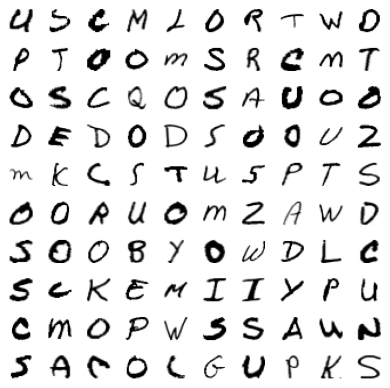
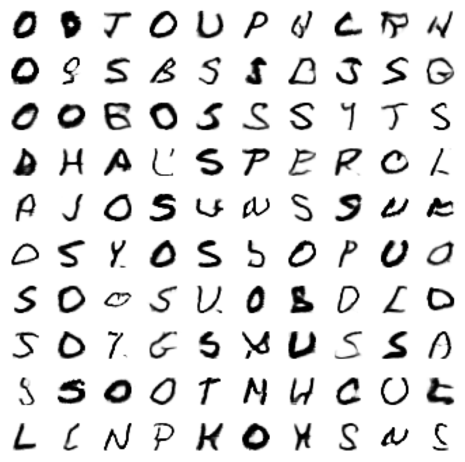

# Handwritten-Characters-GAN
A Generative Adversial Network for the Handwritten Characters Dataset.

# Dataset
The dataset is automatically loaded in from Kaggle through the api.  
It's available here: [Kaggle](https://www.kaggle.com/datasets/sachinpatel21/az-handwritten-alphabets-in-csv-format).

# Results
Here is a plot of handwritten characters coming from the dataset:
  
As we can see, the diversification between each and every letter, even among the same subgroup, is quite apparent.  
Both the VAE models I have created beforehand are however incapable of creating such a wide range of results, especially when it comes to the same subgroup of characters. The CVAE model generated legible, yet too similar within the same subgroups, characters.

In order to imporove the variety of generated images, I've decided to create a simple GAN model. 

Underneath is a plot of handwritten characters generated by a simple GAN model:
  
This plot shows a great improvement in the diversification of produced images. Each letter has its own quirks, they differ in size and thickness, many of their features are crooked. 
That being said, it is apparent that in this particular model the legibility of produced result suffers. Some images don't even represent real characters, they are just supposed to look like real characters to a discriminator part of the model. This can be improved by using conditional GAN models instead.
For now, however, this model will suffice.
